# 🛒 Olist Analytics Platform
### End-to-End Customer 360 Analytics using Databricks & Power BI

[](https://databricks.com/)
[](https://delta.io/)
[](https://powerbi.microsoft.com/)
[](https://www.python.org/)
[](https://www.postgresql.org/)

---

## 📊 Project Overview

A comprehensive data analytics platform built on **Databricks** that transforms raw e-commerce data into actionable business insights. This project demonstrates the complete data lifecycle - from ingestion to predictive analytics - using modern cloud-native technologies.

**Business Impact:**
- 🎯 Customer segmentation enabling personalized marketing strategies
- 📉 Churn prediction identifying at-risk customers worth more than R$ 8M+ in revenue
- 📈 Product performance analytics optimizing inventory and pricing
- 🗺️ Geographic insights driving regional expansion decisions

---

## 🎯 Key Features

### Data Engineering
- **Medallion Architecture** (Bronze → Silver → Gold) for data quality
- **Delta Lake** for ACID transactions and time travel capabilities
- **Unity Catalog** for enterprise-grade data governance
- **100K+ orders** processed across 9 data sources

### Machine Learning
- **Customer Segmentation** using K-Means clustering (5 distinct segments)
- **Churn Prediction** with Random Forest (AUC > 0.75 | 0.998)
- **RFM Analysis** for customer value scoring
- **CLV Modeling** projecting 12-month CLV (customer lifetime value)

### Analytics & Visualization
- **Databricks SQL Dashboards** for real-time monitoring
- **Power BI Dashboards** for executive reporting
- **8 key SQL queries** covering all business metrics
- **Interactive filters** by date, geography, and segments

---

## 🏗️ Architecture

```mermaid
flowchart TD
    A["🗂️ DATA SOURCE<br><strong>Brazilian E-Commerce Public Dataset by Olist (Kaggle)</strong><br>9 CSV files | 100K orders | 2016-2018"] -->|Databricks Medallion Architecture| B["🥉 BRONZE LAYER<br><strong>Raw Data</strong><br>9 Tables | Delta | Governed"]
    B --> C["🥈 SILVER LAYER<br><strong>Cleaned + Validated</strong><br>5 Tables | Joined | Enriched"]
    C --> D["🥇 GOLD LAYER<br><strong>Business Metrics</strong><br>8 Tables | RFM | CLV | ML Scores"]
    D --> E["🤖 ML MODELS<br>Segmentation | Churn Prediction"]
    D --> F["🔍 SQL QUERIES<br>8 reports"]
    D --> G["📊 POWER BI<br>Dashboard | 4 pages"]
```



**Technology Stack:**
- **Platform:** Databricks (Serverless SQL Warehouse)
- **Storage:** Delta Lake with Unity Catalog
- **Languages:** Python (PySpark), SQL, DAX
- **ML:** Spark MLlib (K-Means, Random Forest)
- **Visualization:** Databricks SQL Dashboards, Power BI

---

## 📈 Sample Insights

### Customer Segmentation Analysis (2016-2018 Dataset)

**Critical Discovery:** Analysis reveals severe customer retention challenges:

| Segment | Customers (%) | Revenue | Avg Value | Status |
|---------|-----------|---------|-----------|--------|
| **Recent Customers** | 23,716 (24.64%) | R$ 3.1M | R$ 133 | Bought recently, watching |
| **Promising** | 23,735 (24.47%) | R$ 1.2M | R$ 54 | Recent activity emerging |
| **Loyal Customers** | 19,295 (20%) | R$ 8.2M | R$ 425 | Consistent buyers |
| **Customers Needing Attention** | 14,857 (15.46%) | R$ 0.8M | R$ 54 | Used to purchase, warning signs detected |
| **Potential Loyalists** | 14,875 (15.43%) | R$ 2M | R$ 132 | Recent promising buyers |

**Key Business Finding:**
- **Average frequency = 1.0 across ALL segments** → 97%+ single-purchase customers
- Only 3% of customers returned for a second order
- Revenue concentration: Top 20% (Loyal) = 53% of total revenue (R$ 8.2M)
- Massive opportunity: Converting 10% to repeat = R$ 1.5M+ additional revenue
- Loyal Customers (20%) have fewer customers but have 3x higher value, generating R$ 8.2M total. Considering that 49% of customers are in early-stage segments (Recent + Promising), there is a huge opportunity to add R$ 440K in revenue by converting just 10% of these to Loyal Customers.
- The absence of Champions and high churn rate indicates the business struggled with retention in 2016-2018. This analysis demonstrates how ML can identify such problems early, enabling proactive intervention.

### Churn Prediction Results (180-Day Window)

**Model Performance:**
- **AUC-ROC:** 99.8% - Near-perfect predictive accuracy
- **Churn Rate:** 59.7% of customers inactive 180+ days  
- **Calibration:** Predicted 59.36% vs Actual 59.69% (excellent match)

**Risk Distribution:**
- **High Risk (Top 20%):** 19,200 customers - R$ 3.1M revenue at risk
- **Medium Risk (Next 30%):** 28,800 customers - R$ 4.8M revenue at risk
- **Low Risk (Bottom 50%):** 48,096 customers - Stable base

**Business Value:** Early identification enables proactive retention. With R$ 7.9M at risk (High + Medium), investing R$ 2.4M in retention campaigns (R$ 50/customer) with 30% success rate yields R$ 2.37M savings = 99% ROI.

The 59.7% churn rate reflects the dataset period (2016-2018) where Olist experienced significant customer retention challenges. The model's 99.8% AUC demonstrates it can accurately identify at-risk customers, enabling targeted retention interventions that could have reduced this churn rate by 15-20% through proactive campaigns.

**Technical Achievement:** Random Forest classifier with 100 trees achieved near-perfect discrimination between churned and active customers, with key predictive features being recency (days since last order), delivery performance, and review scores.

### Product Performance
**Top revenue** 
1. Health & Beauty: R$ 1.25M (9.58%)
2. Watches & Gifts: R$ 1.20M (9%)
3. Bed, Bath & Table: R$ 1.04M (7.7%)
4. Sports & Leisure: R$ 988K (7.4%)
5. Computer Accessories: R$ 912K (6.8%)

**Average Order Value**
1. Computers: R$ 1,098.34
2. Small Appliances, Home, Oven and Coffee: R$ 624.29
3. Agro Industry and Commerce: R$ 342.12
4. Musical Instruments: R$ 281.62
5. Small Appliances: R$ 280.78

**Most Popular**
1. Bed, Bath & Table: 11,115 orders
2. Health & Beauty: 9,670 orders
3. Sports & Leisure: 8,641 orders
4. Furniture & Decor: 8,334 orders
5. Computer Accessories: 7,827 orders

---

## 🚀 Quick Start

### Prerequisites
- Databricks workspace (Community Edition or trial)
- Power BI Desktop (optional, for dashboards)
- Python 3.8+ (for local development)

### Setup Instructions

1. **Clone this repository**
```bash
git clone https://github.com/txago/olist-analytics-platform.git
cd olist-analytics-platform
```

2. **Download the dataset**
- Go to [Kaggle: Brazilian E-Commerce](https://www.kaggle.com/datasets/olistbr/brazilian-ecommerce)
- Download and extract all 9 CSV files

3. **Upload to Databricks**
- Create Unity Catalog volume: `/Volumes/workspace/default/olist_data/`
- Upload all CSV files to the volume
- See detailed steps in [`docs/setup-guide.md`](docs/setup-guide.md)

4. **Run notebooks in order**
```
notebooks/01_bronze_layer.ipynb           # Load raw data
notebooks/02_silver_layer.ipynb           # Clean and transform
notebooks/03_gold_layer.ipynb             # Create business metrics
notebooks/04_ml_segmentation.ipynb.       # Customer segments
notebooks/05_ml_churn_prediction.ipynb    # Churn prediction
```

5. **Execute SQL queries**
- Import queries from `sql/` folder into Databricks SQL Editor
- Run to verify data quality

6. **Open Power BI dashboards** (optional)
- Open `powerbi/Olist_Customer360.pbix`
- Refresh data connection

---

## 📊 Dashboard Previews

### Databricks - Product Performance

*Real-time monitoring for all SQL Queries*

### Power BI - Executive Overview

*KPIs: Revenue, Orders, Customers, AOV | Revenue trends and geographic distribution*

### Power BI - Customer Analytics

*RFM segmentation, customer lifetime value, and behavioral patterns*

### Power BI - Churn Management

*At-risk customers, churn probability distribution, and retention strategies*

### Power BI - Product Performance

*Category performance, product rankings, and revenue contribution*

---

## 🎓 Learning Outcomes

This project demonstrates:

**Data Engineering:**
- ✅ Medallion architecture implementation
- ✅ Delta Lake for data reliability
- ✅ Unity Catalog for governance
- ✅ PySpark for big data processing

**Data Science:**
- ✅ Unsupervised learning (K-Means clustering)
- ✅ Supervised learning (Random Forest classification)
- ✅ Feature engineering and model evaluation
- ✅ Business metric calculation (RFM, CLV)

**Analytics:**
- ✅ SQL query optimization
- ✅ Dashboard design and storytelling
- ✅ DAX measures for advanced calculations
- ✅ Interactive filtering and drill-down

**Business Acumen:**
- ✅ Customer segmentation strategies
- ✅ Churn prediction and retention
- ✅ Product portfolio optimization
- ✅ Data-driven decision making

---

## 📁 Project Structure

```
olist-analytics-platform/
├── notebooks/          # Databricks Python notebooks
├── sql/                # SQL queries for analytics
├── powerbi/            # Power BI files and DAX measures
├── docs/               # Detailed documentation
├── images/             # Dashboard screenshots
└── data/               # Dataset information (not actual data)
```

---

## 🔍 Key Metrics Tracked

| Metric | Definition | Business Value |
|--------|------------|----------------|
| **RFM Score** | Recency + Frequency + Monetary | Identify high-value customers |
| **CLV** | Customer Lifetime Value (12mo) | Predict long-term revenue |
| **Churn Probability** | ML-predicted likelihood to leave | Proactive retention |
| **AOV** | Average Order Value | Pricing strategy |
| **Delivery Performance** | Avg days + delay metrics | Operational efficiency |

---

## 📚 Documentation

Comprehensive documentation available in the [`docs/`](docs/) folder:
- [Architecture Details](docs/architecture.md)
- [Data Engineering Process](docs/data-engineering.md)
- [Machine Learning Models](docs/machine-learning.md)
- [Analytics Dashboards](docs/analytics-dashboards.md)
- [Setup Guide](docs/setup-guide.md)

---

## 🤝 Contributing

This is a portfolio project, but suggestions are welcome! Feel free to:
- Open an issue for bugs or improvements
- Fork and experiment with different approaches
- Share insights you discover in the data

---

## 📄 License

This project uses the [Olist Brazilian E-Commerce dataset](https://www.kaggle.com/datasets/olistbr/brazilian-ecommerce) from Kaggle, which is provided under [CC BY-NC-SA 4.0](https://creativecommons.org/licenses/by-nc-sa/4.0/).

---

## 👨‍💻 Author

**Thiago Menezes**
- LinkedIn: [@txago](https://linkedin.com/in/txago)
- Portfolio: [txago.com](https://txago.com)

---

## 🙏 Acknowledgments

- **Olist** for providing the anonymized e-commerce dataset
- **Kaggle** for hosting the data
- **Databricks** for the powerful analytics platform
- **Power BI** community for dashboard inspiration

---

⭐ **If you found this project helpful, please give it a star!**